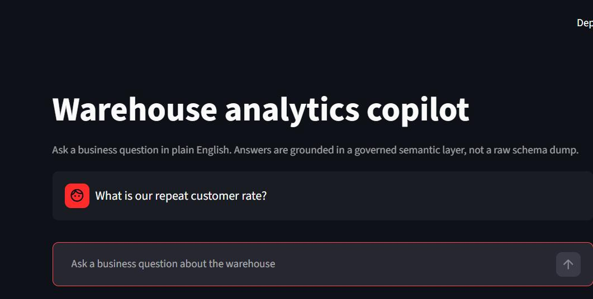
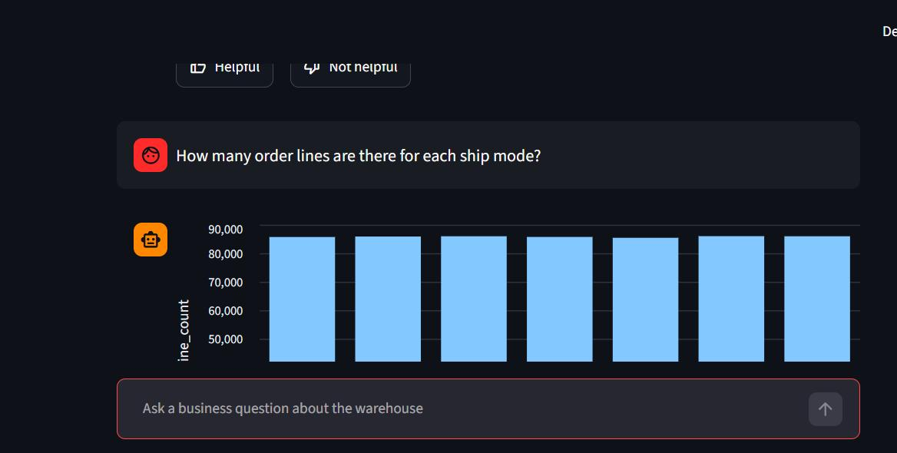
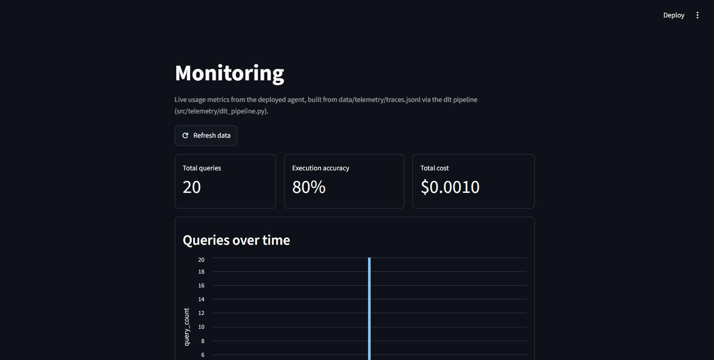
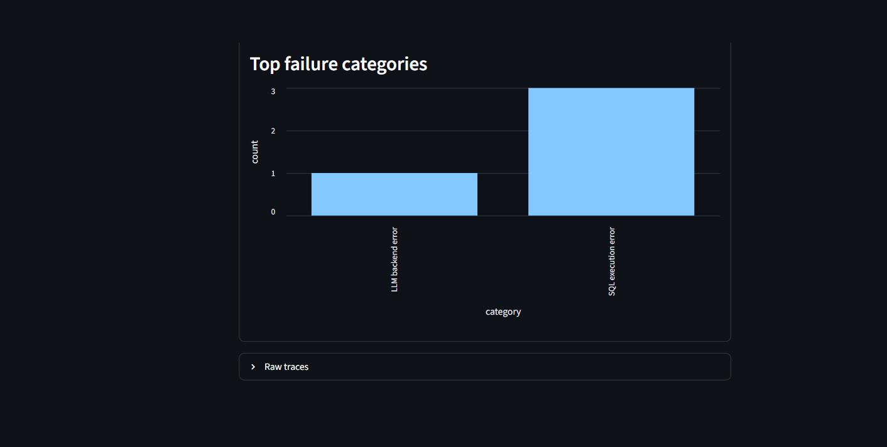

# Usage

Assumes the stack is already running — see [`docs/setup.md`](setup.md) if
not.

## Via the Streamlit UI (`http://localhost:8501`)

Three suggestion pills are shown on load, one per golden-question tier:

- "How many orders do we have in total?" (Tier 1 — single-table)
- "What is total revenue by region?" (Tier 2 — join)
- "What is our repeat customer rate?" (Tier 3 — needs the `metrics.yml`
  definition to answer correctly, not just the right table)

Click a pill, or type any question about the warehouse, and press Enter.



Each answer renders differently depending on its shape
(`src/app/chart.py`'s `pick_chart_kind`):

| Result shape | Renders as |
|---|---|
| One row, one column | Stat tile (e.g. "Repeat customer rate: 1.00") |
| One row, 2-4 columns | KPI row |
| Multiple rows, 2 columns, numeric second column | Bar chart (or line chart if the first column looks like a date) |
| Anything else | Table |



Below every answer:
- **Show SQL** — the exact statement the agent generated and ran
- A caption naming the model used and how many attempts it took (1 or 2 —
  2 means the first attempt failed validation and the agent retried with
  the error fed back)
- **Helpful / Not helpful** buttons — vote once per answer; the buttons
  disable after voting. This feeds the monitoring dashboard's feedback
  rate chart.

If a question fails after both attempts, the UI shows the error and an
"Attempted SQL" expander with the last SQL tried, rather than a wrong
number presented as if correct.

### Questions worth trying, and what they demonstrate

- **"What is our total revenue?"** — Tier 1, single aggregation, exercises
  `metrics.yml`'s `total_revenue` definition directly.
- **"What was the average order value?"** — the reason
  `metrics.yml` exists at all: `fact_orders` is line-item grain, so a
  naive `AVG(net_revenue)` answers a different (wrong) question. See
  the Tier-3 ablation in the README for measured evidence of this.
- **"How many order lines are there for each ship mode?"** — a
  category/value breakdown, renders as a bar chart.
- **A question outside the warehouse's scope** (e.g. "what's the weather
  today") — demonstrates the guardrails and validation refusing to
  fabricate an answer rather than hallucinating a plausible-looking one.

## Via the API directly

```bash
curl -X POST http://localhost:8000/ask \
  -H "Content-Type: application/json" \
  -d '{"question": "How many orders do we have in total?"}'
```

Response shape:

```json
{
  "query_id": "b3f1...",
  "question": "How many orders do we have in total?",
  "sql": "SELECT COUNT(DISTINCT order_key) AS order_count FROM fact_orders",
  "columns": ["order_count"],
  "rows": [[150000]],
  "row_count": 1,
  "succeeded": true,
  "error": null,
  "attempt_count": 1,
  "model": "llama3"
}
```

Submitting feedback (the `query_id` from an `/ask` response, and `"up"`
or `"down"`):

```bash
curl -X POST http://localhost:8000/feedback \
  -H "Content-Type: application/json" \
  -d '{"query_id": "b3f1...", "vote": "up"}'
```

`GET /health` returns `{"status": "ok"}` and is the readiness check the
`ui` and `monitoring` services implicitly depend on (via `api` needing to
be up).

## Monitoring dashboard (`http://localhost:8502`)

Reads `data/telemetry.duckdb`, which the dlt pipeline
(`src/telemetry/dlt_pipeline.py`) loads from the raw trace log every
`/ask`/`/feedback` call writes to. Click **Refresh data** after asking new
questions to re-run the pipeline and see them reflected (it isn't live —
each page load reads whatever was last loaded).



Three KPI tiles (total queries, execution accuracy, total cost), then six
charts: queries over time, execution accuracy over time, cost per query,
latency (p50/p95), feedback rate, and top failure categories — the last
one mechanically classifies each failed trace's error text into one of:
guardrail rejection, query timeout, implausible result, SQL execution
error, LLM backend error, or other.



An expandable **Raw traces** table at the bottom shows every logged
request if you want to inspect one directly rather than through a chart.

The screenshots above are from a real run against the live system (not
synthetic data) — see the README's Monitoring section for how that
telemetry volume was generated.

## Reproducing the evaluation reports

See [`docs/setup.md`](setup.md#reproducing-the-evaluation-numbers) for the
exact commands. Each script writes both a markdown report to
`evaluation/results/` and, for the ablation and error-analysis scripts, a
JSON file of full per-question outcomes for anyone who wants to inspect
individual generated SQL rather than just the summary numbers.
